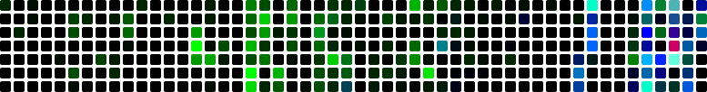

# Mo
> Student developer exploring software, systems, and everything in between.

## Projects
| Project | Stars | Commits | Time/AI |
|:-------:|:--:|:-----:|:--------:|
| <picture><source media="(prefers-color-scheme: dark)" srcset="https://cdn.simpleicons.org/github/white"><source media="(prefers-color-scheme: light)" srcset="https://cdn.simpleicons.org/github/black"></picture> [nixos-config](https://github.com/MoDevIO/nixos-config) |  |   |   |
| <picture><source media="(prefers-color-scheme: dark)" srcset="https://cdn.simpleicons.org/github/white"><source media="(prefers-color-scheme: light)" srcset="https://cdn.simpleicons.org/github/black"></picture> [embedded-simulator](https://github.com/MoDevIO/embedded-simulator) |  |   |   |
| <picture><source media="(prefers-color-scheme: dark)" srcset="https://cdn.simpleicons.org/github/white"><source media="(prefers-color-scheme: light)" srcset="https://cdn.simpleicons.org/github/black"></picture> [LELIT-PL81T-UART](https://github.com/MoDevIO/LELIT-PL81T-UART) |  |   |   |
| <picture><source media="(prefers-color-scheme: dark)" srcset="https://cdn.simpleicons.org/github/white"><source media="(prefers-color-scheme: light)" srcset="https://cdn.simpleicons.org/github/black"></picture> [github-wakatime-activity](https://github.com/MoDevIO/github-wakatime-activity) |  |   |   |
| <picture><source media="(prefers-color-scheme: dark)" srcset="https://cdn.simpleicons.org/github/white"><source media="(prefers-color-scheme: light)" srcset="https://cdn.simpleicons.org/github/black"></picture> [connect-four-readme](https://github.com/MoDevIO/connect-four-readme) |  |   |   |
| <picture><source media="(prefers-color-scheme: dark)" srcset="https://cdn.simpleicons.org/github/white"><source media="(prefers-color-scheme: light)" srcset="https://cdn.simpleicons.org/github/black"></picture> [autolsp.nvim](https://github.com/MoDevIO/autolsp.nvim) |  |   |   |

## Tech Stack

| Category | Stack |
|:--:|:-----:|
| **Languages** |  JavaScript &nbsp;·&nbsp;  TypeScript &nbsp;·&nbsp;  Python &nbsp;·&nbsp;  Lua &nbsp;·&nbsp;  Nix |
| **Web** |  HTML &nbsp;·&nbsp;  CSS &nbsp;·&nbsp;  React &nbsp;·&nbsp; <picture><source media="(prefers-color-scheme: dark)" srcset="https://cdn.simpleicons.org/nextdotjs/white"><source media="(prefers-color-scheme: light)" srcset="https://cdn.simpleicons.org/nextdotjs/black"></picture> Next.js &nbsp;·&nbsp;  Vite &nbsp;·&nbsp;  Tailwind &nbsp;·&nbsp; <picture><source media="(prefers-color-scheme: dark)" srcset="https://cdn.simpleicons.org/shadcnui/white"><source media="(prefers-color-scheme: light)" srcset="https://cdn.simpleicons.org/shadcnui/black"></picture> shadcn |
| **Systems & Tools** |  Linux &nbsp;·&nbsp;  NixOS &nbsp;·&nbsp;  Neovim &nbsp;·&nbsp; <picture><source media="(prefers-color-scheme: dark)" srcset="https://cdn.simpleicons.org/github/white"><source media="(prefers-color-scheme: light)" srcset="https://cdn.simpleicons.org/github/black"></picture> GitHub &nbsp;·&nbsp;  VS Code |

## About

I'm a student developer who enjoys building things across different areas of software and systems. I really enjoy coding my ideas to life.

My interests range from web development and developer tools to Linux systems and open-source projects. Most of my knowledge comes from experimenting with my own projects.

